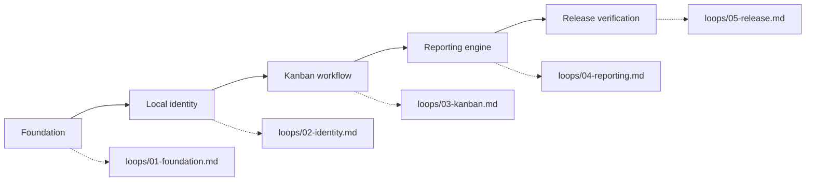

# LedgerLane development graph

This prototype is delivered as a sequence of independently verifiable loops. Each loop must satisfy its check before the next node is entered.

Chrome drain (after the product loops) lives in [DRAIN_GRAPH.md](DRAIN_GRAPH.md).

## Epics and milestones

| Epic | Milestone | Exit criterion |
| --- | --- | --- |
| E1 — Foundation | M1 Minimal-brutalist shell | Responsive navigation, accessible tokens, and IndexedDB repository exist. |
| E2 — Local collaboration | M2 Local account switching | A person can sign up, sign in, sign out, and switch among accounts on one browser profile. |
| E3 — Delivery workflow | M3 Kanban operations | A user can create, edit, drag, filter, and delete tasks across three states. |
| E4 — Time integrity | M4 Timestamp controls | Created and completed date/time can be overridden, with an explicit audit marker. |
| E5 — Reporting | M5 Three report lenses | Invoice, project manager, and stakeholder reports react to date/time/detail settings and can be downloaded or printed. |
| E6 — Release confidence | M6 Automated verification | Domain tests, syntax checks, and a browser smoke check pass. |

## Data and trust boundaries

- Data remains in the browser's IndexedDB database (`ledgerlane-db`). There is no network API.
- Credentials are local-only and hashed with Web Crypto before storage. No secrets are embedded in source.
- “Multiple users” means multiple local accounts using the same browser profile on the same computer. It is not synchronization across devices.
- Timestamp overrides are deliberate reporting adjustments and are visibly labeled in the task editor and reports.

