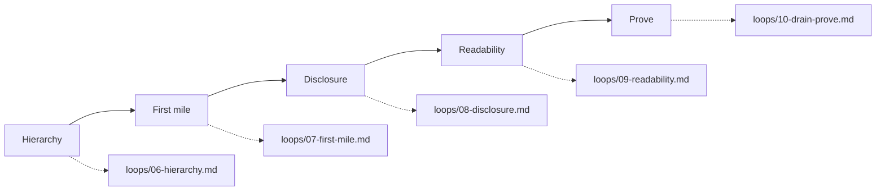

# LedgerLane drain graph

The 16 Sep 2026 `/critique` scored the chrome **24/40** with **high cognitive load**. This graph drains that chrome — same features, fewer obstacles — against [STYLE_GUIDE.md](STYLE_GUIDE.md).

Each loop is independently verifiable. Do not enter the next node until the current check is green.

Board structure (add / rename / type / delete columns) is a separate mode. See [loops/11-board-structure.md](loops/11-board-structure.md).

## Loops

| Loop | Goal | Exit criterion |
| --- | --- | --- |
| 06 Hierarchy | The work is the page | At 900×700, board cards and the report sheet are on screen. Page titles use the Title role, not Display. |
| 07 First mile | Auth and waiting are one job | Sign-in is username + passphrase. Signup hides account type. Waiting names admins and has Sign out. Avatar opens an Account menu. |
| 08 Disclosure | Four things, then a door | Task chips and report Display start closed. Signup roles start closed. Invite stays closed. |
| 09 Readability | Glanceable type | Hints are 16px sentence case. Stamps ≥11px. `--muted` ≥4.5:1. Focus rings on every control. `#app` is not live. |
| 10 Prove | Nothing important vanished | `npm test`, `npm run check`, `npm run verify`. Walk auth → wait → board → task → reports → People in a browser. |
| 11 Board structure | Columns behind a door | Edit board in the topbar. Add / rename / type / delete only in that mode, via the column modal. |

## What we are not removing

- Board membership, roles, invite, viewer lock
- Add-column modal, More actions, selection bar
- Reports lenses, project filters, Notion / ClickUp / JSON export
- The paper / ink / acid look

Drain is subtraction of chrome, not features.

## Prompt for a new agent

Copy the loop file for the node you are on. Do not skip to Prove until 06–09 are done. If a later loop fights an earlier one, fix the earlier loop — do not re-inflate the page head.
